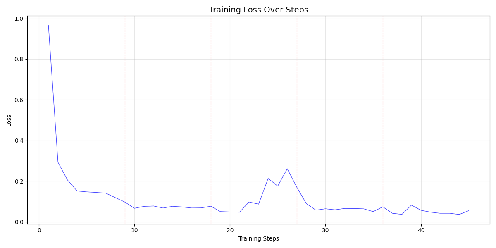
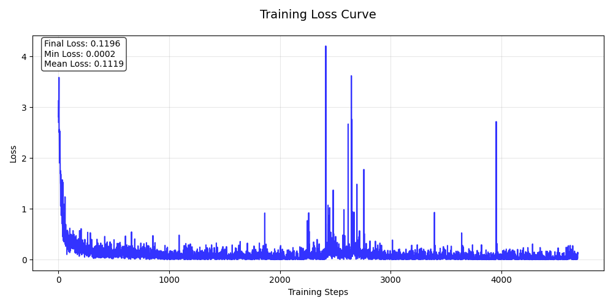
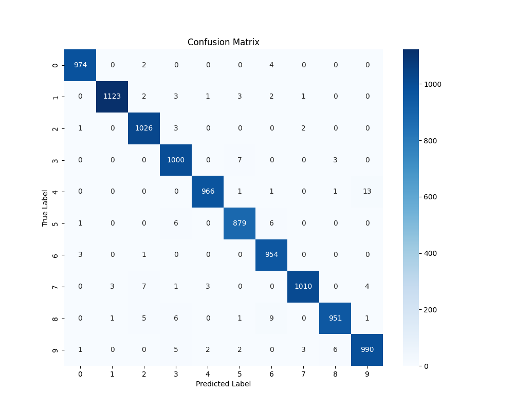
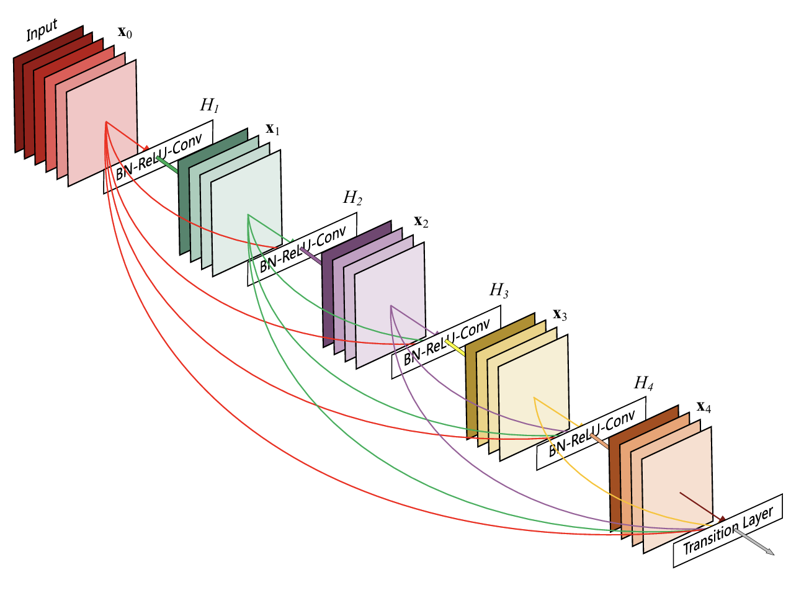
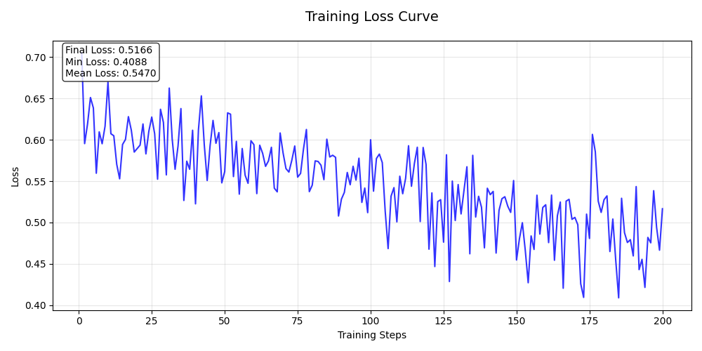
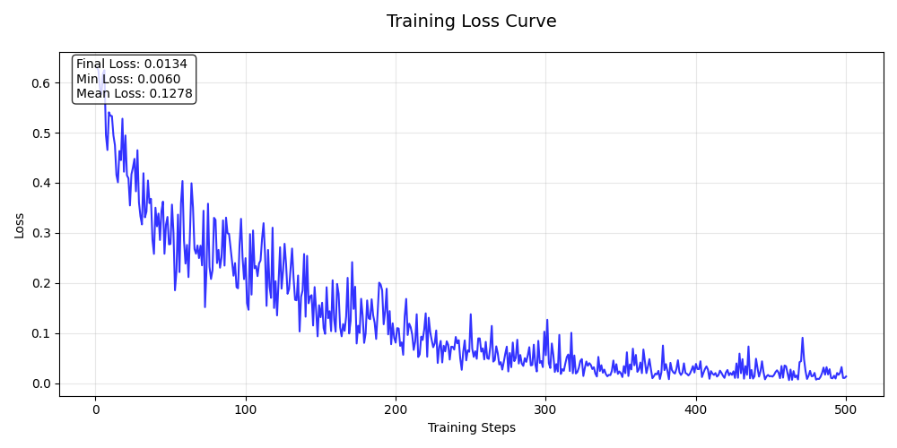
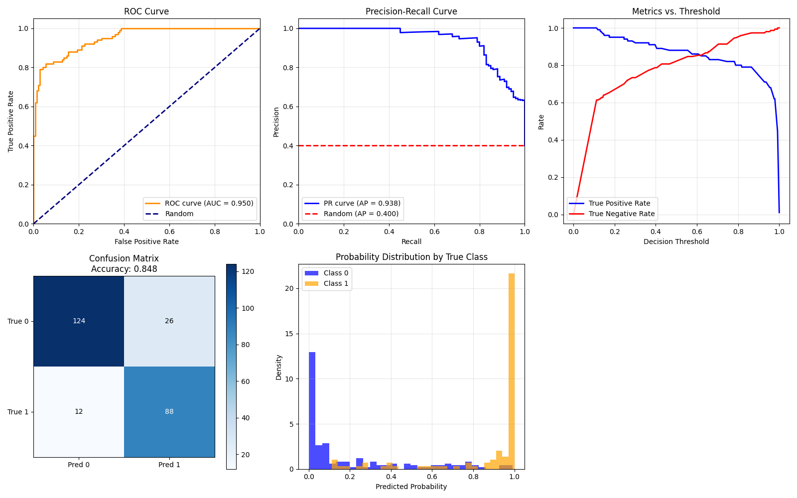

# ML-Class-Assignment

BUAA机器学习基础实验


## 实验一
[](https://arxiv.org/abs/1512.03385)

### 实验内容

使用深度残差网络ResNet解决MNIST手写数字分类问题。

### 项目结构
```
ML-Class-Assignment/
├── exp01/                   # 实验一：手写数字识别
│   ├── results/             # 结果保存
│   ├── model.py             # 模型定义文件
│   ├── train.py             # 模型训练脚本
│   ├── eval.py              # 模型评估脚本
|   ├── step_loss.py         # step loss绘图
│   |__ model_visualization.py     # 模型结构可视化
│__ README.md           # 项目说明文档
```

### 实验环境

```
# 超参数设置
batch_size = 64
learning_rate = 0.001
epochs = 5
optimizer = AdamW
loss_function = CrossEntropyLoss
# 数据预处理  
transform = transforms.Compose([  
    transforms.Resize((28, 28)),  # 确保尺寸一致  
    transforms.ToTensor(),  # 转换为Tensor  
    transforms.Normalize((0.5,), (0.5,))  # 归一化到[-1,1]  
])
```
### 实验结果
- 训练集准确率：99.09%
- 测试集准确率：98.73%
- 损失函数曲线：

<div align="center">
  
  
</div>

- 分类混淆矩阵

<div align="center">
  
</div>

## 实验二

[](https://arxiv.org/abs/1608.06993)

### 实验内容

本实验使用DenseNet-121深度卷积神经网络对医学图像进行二分类（患病/无病）任务。实验包含完整的训练、评估和可视化流程，支持断点续训和多种性能指标评估。

### 项目结构

```
exp02/
├── model.py              # DenseNet模型定义
├── train.py             # 训练脚本
├── draw_roc.py          # 可视化评估指标
├── data/                # 数据目录
│   ├── 2-MedImage-TrainSet/    # 训练集（1639张图像）
│   └── 2-MedImage-TestSet/     # 测试集（250张图像）
├── checkpoints/         # 模型权重保存目录
└── results/            # 实验结果和可视化图表
```

### 数据格式

- 图像尺寸：600×600像素，JPEG格式

- 命名规则：

    - 患病图像：disease_xxx.jpg

    - 无病图像：normal_xxx.jpg

- 数据分布：

    - 训练集：1639张图像

    - 测试集：250张图像

### 模型架构

<div align="center">
  
</div>

### 实验结果

#### 损失收敛分析

<div align="center">
  
  
</div>

左侧图像超参数：

```
batch_size = 16
learning_rate = 0.05
epochs = 20
optimizer = Adam
loss_function = CorsseEntropyLoss
transform = transforms.Compose([
    transforms.Resize((600, 600)),  # 调整图像尺寸以适应任务输入要求
    transforms.ToTensor(),  # 转换为Tensor
    transforms.Normalize([0.5, 0.5, 0.5], [0.5, 0.5 0.5])
])
```

**存在问题：**

1. 学习率设置得太大了。使用的是Adam优化器。对于Adam来说，0.5是一个极其巨大的数值。通常 Adam 的学习率设置在1e-3~1e-4之间。
2. 图像尺寸输入最初设置的是(600x600)
   ，DenseNet标准输入通常是224x224。600x600太大了，会导致计算量剧增，且对于只有几千张图的数据集来说，过多的像素反而是噪声，改为Resize((
   224, 224))。

修改之后超参数：

```
batch_size = 16
learning_rate = 0.0001
epochs = 50
optimizer = Adam
loss_function = CorsseEntropyLoss
transform = transforms.Compose([
    transforms.Resize((224, 224)),  # 调整图像尺寸以适应任务输入要求
    transforms.ToTensor(),  # 转换为Tensor
    transforms.Normalize([0.485, 0.456, 0.406], [0.229, 0.224, 0.225])
])
```

训练效果：见results/train.txt

#### ROC曲线,PR曲线

<div align="center">
  
</div>

### 模型修改说明
需要修改 **`forward` 函数** 中的 **池化层（Pooling layer）** 代码。

修改方案

将 `forward` 函数中的这一行：

```
out = F.avg_pool2d(features, 7, stride=1).view(features.size(0), -1)
```

**修改为：**

```
out = F.adaptive_avg_pool2d(features, (1, 1)).view(features.size(0), -1)
```

虽然最后使用的是224x224的输入尺寸，但使用自适应池化更为稳妥。

---

为什么要修改这里？

1. **原代码的逻辑：**
   * 原始 DenseNet 设计针对的是 ImageNet 数据集，标准输入是 **224x224**。
   * 经过 5 次下采样（conv0 和 4 个 DenseBlock 后的 transition/pooling），特征图大小缩小了 32 倍（$`2^5`$）。
   * $`224 / 32 = 7`$。因此，原始代码使用了固定大小为 **7** 的卷积核 (`kernel_size=7`) 进行平均池化，正好将 $7\times7$
     的特征图变成 $1\times1$，然后展平输入全连接层。

2. **输入改为 600x600 后的问题：**
   * 当输入变为 **600x600** 时，经过 32 倍下采样，最后的特征图大小约为 **18x18** ($600 / 32 = 18.75$)。
   * 如果你继续使用 `F.avg_pool2d(features, 7, stride=1)`，它会在 $`18\times18`$ 的图上用 $`7\times7`$ 的窗口滑窗，导致输出的特征图不再是
     $`1\times1`$，而是约$`12\times12`$。
   * 这会导致后续的 `view(features.size(0), -1)` 展平后的向量维度变大，从而与 `self.classifier` 定义的输入维度不匹配，报错
     **RuntimeError: mat1 and mat2 shapes cannot be multiplied**。

### 解法：`F.adaptive_avg_pool2d`

使用 **自适应平均池化（Adaptive Average Pooling）** 是通用的解决方案。

* `F.adaptive_avg_pool2d(features, (1, 1))` 的意思是：“不管输入的特征图尺寸（H x W）是多少，请帮我自动计算步长和核大小，最终输出
  **1x1** 的特征图”。
* 这样无论以后将图片改为 600x600、512x512 还是其他尺寸，这行代码都不需要再修改。